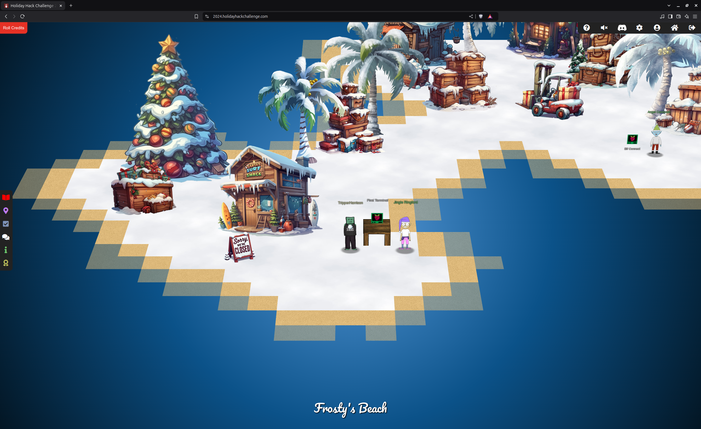
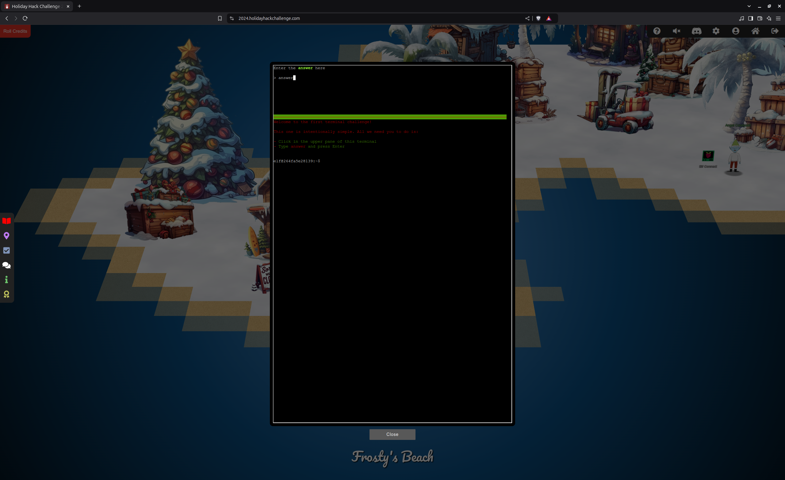

**2024 SANS Holiday Hack Challenge post writeup**

**Author:**          Tripper Harrison

**Objective #1:**    Holiday Hack Orientation

***Difficulty:*** *  1/5 (easiest)*

**Description:**     Talk to Jingle Ringford on Christmas Island and get your bearings at Geese Islands

*figure 1: First Terminal and Jingle Ringford, on Christmas Island*

**Conversations**

Jingle Ringford (Frosty's Beach)

*Welcome to the Geese Islands and the 2023 SANS Holiday Hack Challenge!*

*I'm Jingle Ringford, one of Santa's many elves.*

*...*

*Just kidding! It's actually the 2024 SANS Holiday Hack Challenge!*

*And although we're on Frosty's Beach on Christmas Island, we'll soon be
on our way back to the North Pole.*

*I thought it best to wait here for people that heard we're on the Geese
Islands but may not know we're leaving.*

*I haven't seen Santa since we started packing up, but he always asks me
to give a quick orientation to newcomers, so I'm continuing the
tradition.*

*Before you head out any further onto the island, you need to accomplish two
simple tasks.*

*But first, here's a parting gift. I packed this snowball made of the
magical, never-melting snow of Christmas Island. A little souvenir to
take with you when we leave for the North Pole.*

*Click on the snowball on your avatar. That's where you will see your
Objectives, Hints, resource links, and Conversations for the Holiday
Hack Challenge.*

*Now, click on the Cranberry Pi Terminal and follow the on-screen
instructions.*

**First Terminal**

*figure1: First Terminal text*

**First Terminal Text**

Welcome to the first terminal challenge!

This one is intentionally simple. All we need you to do is:

Click in the upper pane of this terminal

Type answer and press Enter

**Solution**

As prompted, typing the word, "answer" in the upper pane of the terminal and pressing "Enter" completes this challenge.  The terminal window closes.

**Continue the conversation with Jingle Ringford:**

*You're a natural! Something new this year you may not know is that all
challenges have an easy and hard mode. There's also story mode, if
you want to skip the challenges and watch how our holiday season's
adventure unfolds!*

*Your snowball will reflect how you've solved the challenges with the
bronze, silver, and gold trophies.*

*Well, that's it, now you're orientated! Feel free to get yourself settled
in, establish a cohort with others, or just explore this lovely
island. Just be careful where you walk as we are moving around some
pretty heavy crates.*

*Oh, while we're preparing everything to set sail for the North Pole, I
heard Poinsettia McMittens and Angel Candysalt could use some
assistance. I'm sure they'll appreciate any help you can provide!*

*We'll let you know when the boat leaves, but for now relax, enjoy the sun,
and most importantly, have FUN!*

**Conclusion**

Elf Connect and Elf Minder 9000 challenges are assigned.
