# 2024 SANS Holiday Hack Challenge post writeup

- Objective #2:  Elf Connect

- Difficulty:  1/5 (easiest)

- Description:  Help Angel Candysalt connect the dots in a game of connections.

- Location:  Frosty's Beach, center

  

## Objective Location

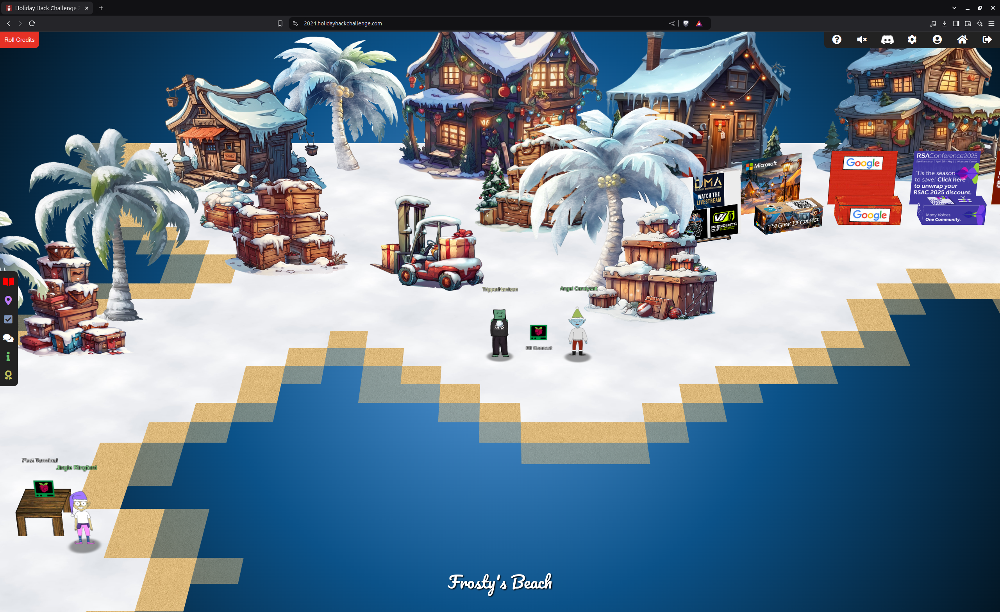

*figure 1: First Terminal and Angel Candysalt, on Christmas Island*

  

## Conversations

Angel Candysalt (Frosty's Beach)

*Welcome back, island adventurer! 

*I'm Angel Candysalt -- so happy to finally meet you!*

*I'm thrilled you're here because I could really use a hand with something.*

*Have you ever heard of a game called Connections?*

*It’s simple! All you need to do is find groups of four related words.*

*I've been stuck on it all day, and I'm sure someone*

*as sharp as you will breeze through it.*

*Oh, and while you're at it, check out randomElf's*

*score — they hit fifty thousand points, which seems…*

*oddly suspicious.*

*Think they might have tampered with the game? Just a hunch!**

  

## Elf Connect

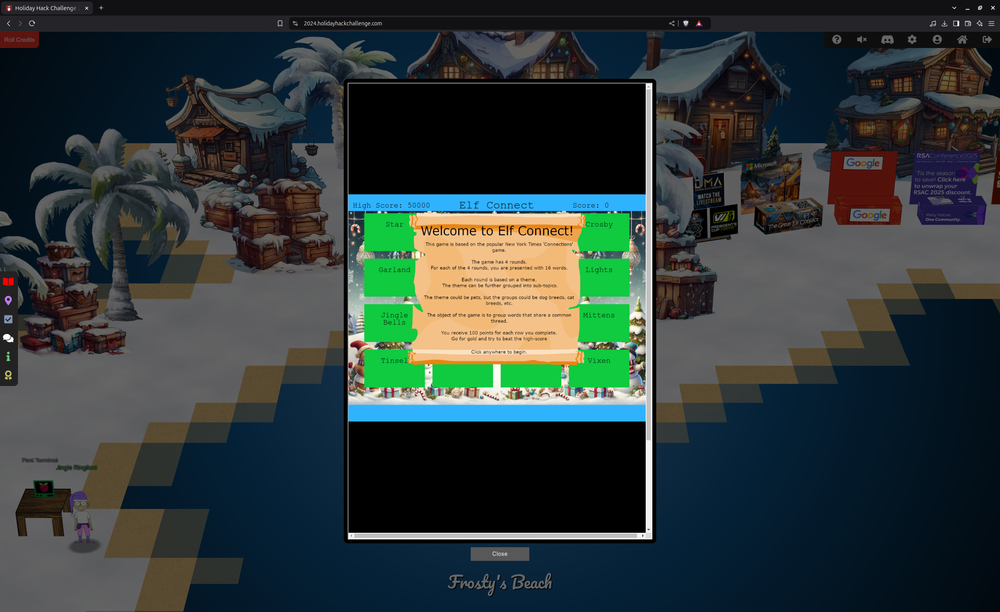

*figure2: Elf Connect*

  

## Gameplay

As the instructions convey, the goal of the game is to match words that have a common association.  Like most of the objectives, there are three difficulty levels.

Bronze:  story mode, where the challenge is effectively skipped.

Silver:  the less-difficult approach.

Gold:  the most difficult approach.

  

## Normal Gameplay

### Round 1 word associations:  Christmas Theme

Items associated with Santa Claus:  Sleigh, Bag, Gifts, Mittens

Famous reindeer:  Comet, Vixen, Prancer, Blitzen

Singers and songs:  Belefonte, White Christmas, Crosby, Jingle Bells

Christmas Trees:  Lights, Tinsel, Star, Garland

 

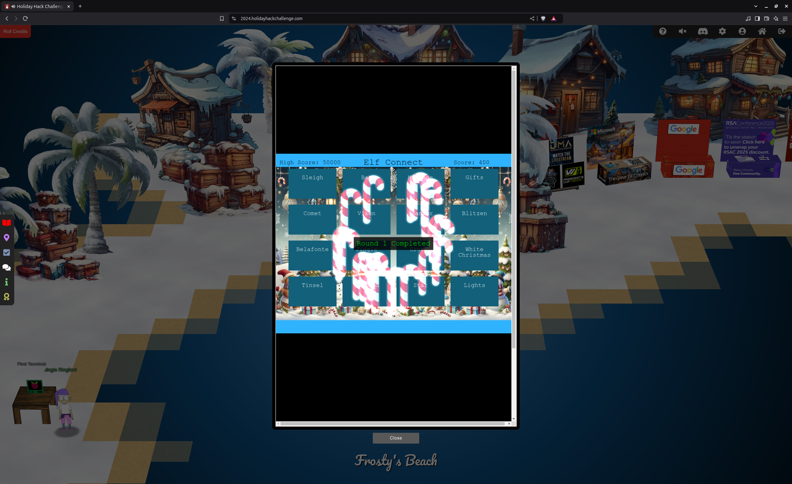

  

### Round 2 word associations:  InfoSec Tools

Web application vulnerability scanners:  burp, OWASP Zap, Nikto, wfuzz

Instrumentation tools:  Frida, Cycript, AppMon, apktool

Network tools:  Nmap, netcat, Wireshark, Nessus

Pen test tools:  Metasploit, Cobalt Strike, HAVOC, Empire

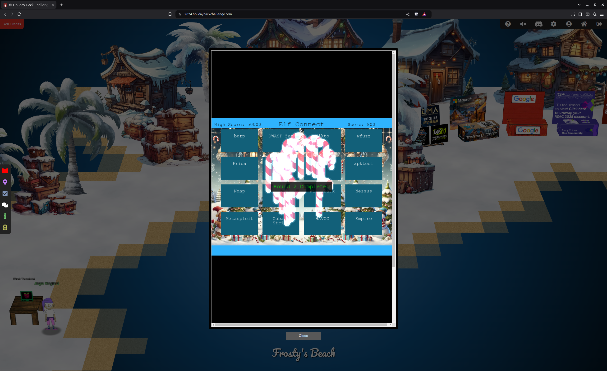

 

 

### Round 3 word associations:  Cryptography

Wireless Ethernet security items:  WEP, WPA2, TKIP, LEAP

Block ciphers:  AES, RSA, Blowfish, 3DES

Substitution Ciphers:  Caesar, One-time Pad, Ottendorf, Scytale

Key exchanges:  Symmetric, Asymmetric, hash, hybrid

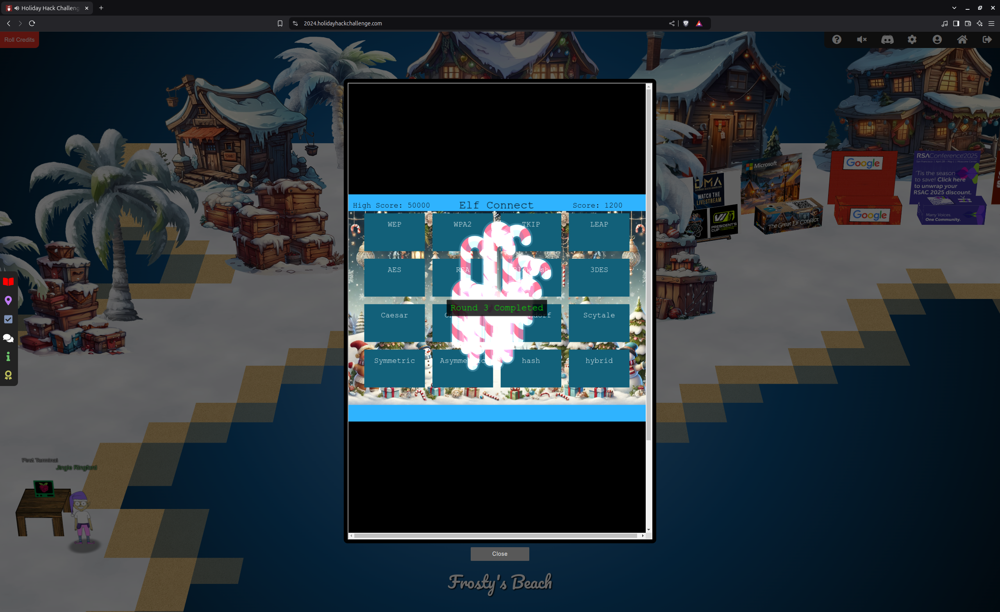

 

 

### Round 4 word associations:  OSI Reference Model

L7 Items (Application):  HTTP, FTP, SMTP, DNS

Secure Network Transports:  TLS, SSL, IPSec, SSH

L3 Protocols (Network):  IGMP, IPX, IP, ICMP

L1/L2 Items (Physical/Data Link):  Ethernet, PPP, IEEE, 802.11, ARP

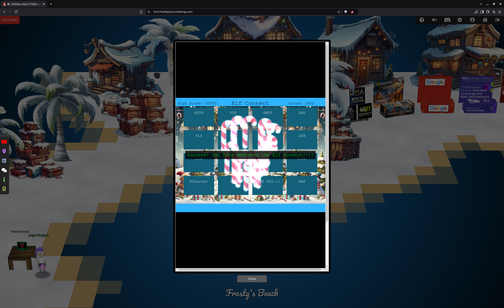

 

 

#### Silver trophy is awarded.

 

 

The gold trophy is awarded by exceeding a high score of over 50,000, which seems impossible, considering completing the four rounds will attain only 1600 points.

To get a higher score, overriding the client-side variable that contains the score is the goal.

Open the browser developer tools, select Sources, find the source for the game iFrame; search for score

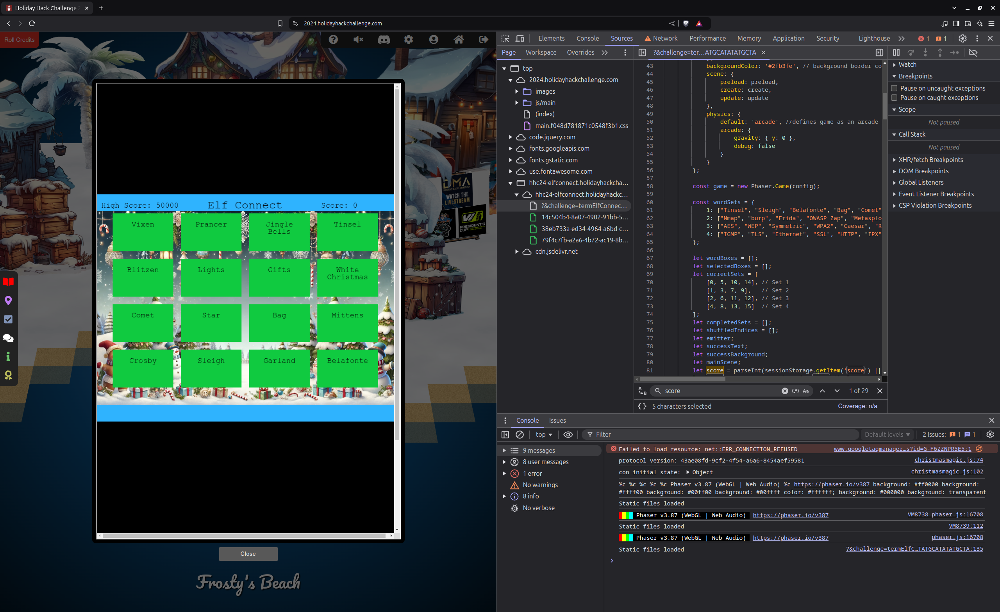 

  

It looks like there's a variable, named score.

Open the console, set the context to hhc24-elfconnect.holidayhackchallenge.com, and set score to 50001.

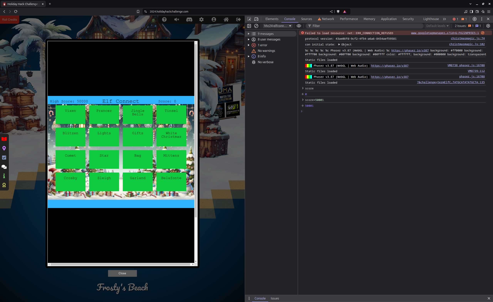

 

 

Now, all we need to do is to play the game until...

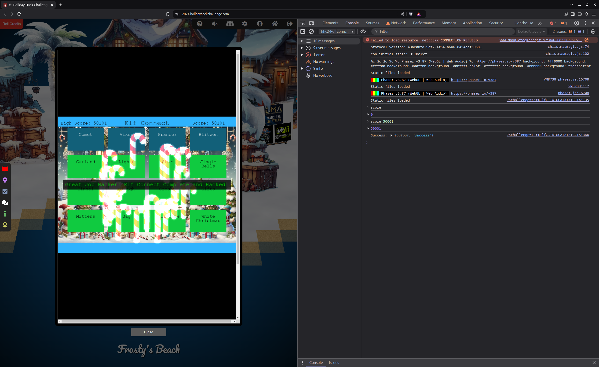

## Solution

As prompted, typing the word, "answer" in the upper pane of the terminal and pressing "Enter" completes this challenge.  The terminal window closes.

  

Gold trophy awarded, but there's another way...

  

Let's take a deeper look into the source.  It looks like the answers were provided:

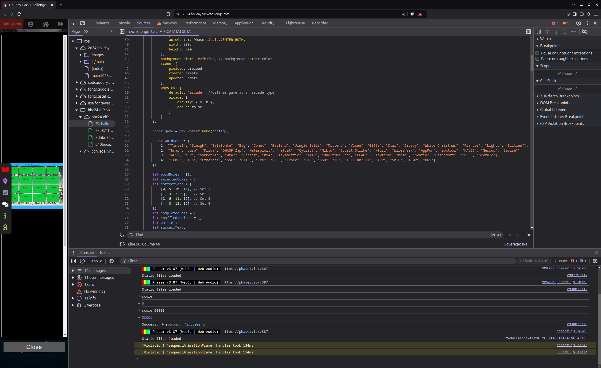

 

 

But wait, there's more:

This code appears to be related to winning the game:

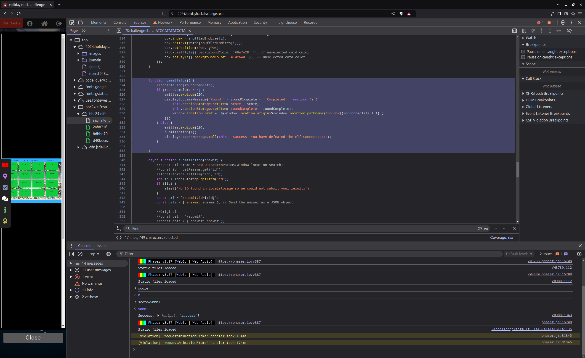

  

Let's send to the console, submitAction(1), and see what happens:

## Continue the conversation with Jingle Ringford:

*You're a natural! Something new this year you may not know is that all
challenges have an easy and hard mode. There's also story mode, if
you want to skip the challenges and watch how our holiday season's
adventure unfolds!*

*Your snowball will reflect how you've solved the challenges with the
bronze, silver, and gold trophies.*

*Well, that's it, now you're orientated! Feel free to get yourself settled
in, establish a cohort with others, or just explore this lovely
island. Just be careful where you walk as we are moving around some
pretty heavy crates.*

*Oh, while we're preparing everything to set sail for the North Pole, I
heard Poinsettia McMittens and Angel Candysalt could use some
assistance. I'm sure they'll appreciate any help you can provide!*

*We'll let you know when the boat leaves, but for now relax, enjoy the sun,
and most importantly, have FUN!*

  

## Conclusion

Elf Connect and Elf Minder 9000 objectives are assigned.
